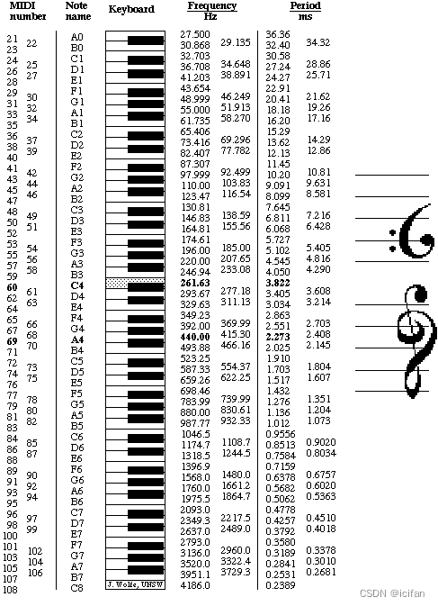

> 1. 接收音符输入
> 2. 模拟不同乐器的声音
> 3. 能处理和弦（多个音符同时发声）

https://www.audiolabs-erlangen.de/resources/MIR/FMP/C1/C1.html

---

## 🎼 一、整体设计思路（概览）

| 模块         | 功能描述                                                 |
| ------------ | -------------------------------------------------------- |
| 音符解析模块 | 将音符序列（如 C4、D#5）转为对应频率                     |
| 声音合成模块 | 根据不同“乐器模型”合成不同音色（正弦、方波、谐波叠加） |
| 和弦处理模块 | 支持多个音符同时发声并混合                               |
| 包络控制模块 | 通过 ADSR 包络控制振幅变化（模拟真实乐器发音）           |
| 输出模块     | 将最终信号播放或保存为音频文件（如 WAV）                 |

---

## 🎹 二、模块设计详解

### 1. **音符输入与频率映射**

使用十二平均律将音符转为频率：

$$
f_n = 440 \cdot 2^{(n - 69)/12}
$$

其中 `n` 是从 A0 = MIDI 编号 21 开始。

C4 (中央C)	60	261.63Hz

可构造音符 → 频率的映射表，例如：

```python
note_freq = {
  "C4": 261.63, "D4": 293.66, "E4": 329.63, ..., "A4": 440.00
}
```



支持输入格式：

```
输入示例：["C4", "E4", "G4"] → 和弦
输入示例：["C4", "D4", "E4", "G4"] → 旋律
```

bpm：每分钟有多少个节拍

对于一个音符，时长为一个节拍，则时值为1/bpm*60

模拟钢琴的话音符用的正弦波：$volumn*sin(2*\pi*wt)$

---

### 2. **不同乐器音色的合成方法**

不同乐器声音的主要区别在于波形（谐波结构）和包络（ADSR），可以用以下方式模拟：

| 乐器   | 合成方法（示意）                      |
| ------ | ------------------------------------- |
| 钢琴   | 正弦波 + 弱谐波 + 快速衰减包络        |
| 小提琴 | 锯齿波 + 平稳持续包络                 |
| 吉他   | 方波或谐波叠加 + 快速衰减包络         |
| 管乐器 | 正弦 + 3\~5 次谐波合成 + 演奏动态包络 |

**示例**：谐波合成（正弦+谐波）

$$
x[n] = \sum_{k=1}^{K} a_k \cdot \sin(2\pi k f n / f_s)
$$

其中 $a_k$ 控制各谐波的强度。

---

### 3. **和弦处理**

和弦即多个音符同时发声，处理方式是**多个波形的叠加**：

```python
y_total = y_note1 + y_note2 + y_note3
```

为避免音量过大（失真），应进行归一化或限制最大幅度。

---

### 4. **ADSR 包络调制**

真实乐器的声音不是一开始就达到最大音量。常用的包络模型为：

* A（Attack） 上升时间
* D（Decay） 衰减时间
* S（Sustain）持续电平
* R（Release）释放时间

包络函数可乘在波形上，使声音更自然。

```python
x[n] = envelope[n] * wave[n]
```

---

### 5. **输出模块**

合成最终的波形后：

* 可以用 `sound()` 或 `soundsc()`（MATLAB）
* 或 `sounddevice.play()`（Python）
* 也可使用 `audiowrite` / `scipy.io.wavfile.write()` 保存为 `.wav` 文件

---

## 🛠 三、可选优化扩展

* 增加 GUI，点击按键播放
* 支持 MIDI 文件读取
* 加入混响或空间感模拟（使用 FIR 卷积）
* 实时合成（Python + PyAudio）

---

## ✅ 示例流程图

```
输入音符序列
   ↓
映射为频率
   ↓
按乐器选定合成方式（波形 + 谐波 + 包络）
   ↓
是否为和弦？→ 是则叠加多个音符
   ↓
输出：播放或保存为音频
```

---
